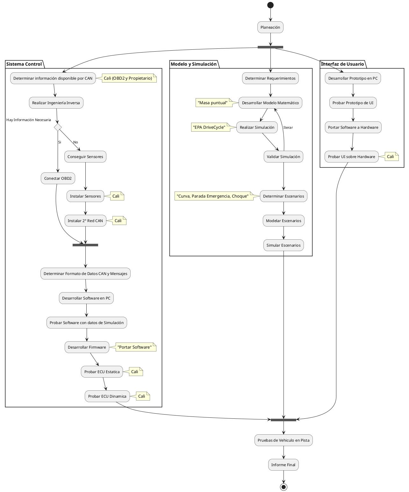

# Actividades

```plantuml
@startuml

(*) --> "Planeación"
--> ===P1===

=== E1 === --> "Pruebas de Vehiculo en Pista"
--> "Informe Final"
--> (*)


partition "Modelo y Simulación" {
  ===P1=== --> "Determinar Requerimientos"
  --> "Desarrollar Modelo Matemático" 
  note left: "Masa puntual"
  --> "Realizar Simulación"
  note left: "EPA DriveCycle"
  --> "Validar Simulación"
  -->[Iterar] "Desarrollar Modelo Matemático"
  "Validar Simulación" -->  "Determinar Escenarios"
  note left: "Curva, Parada Emergencia, Choque"
  --> "Modelar Escenarios"
  --> "Simular Escenarios"
  --> ===E1===
}


partition "Interfaz de Usuario" {
  ===P1=== --> "Desarrollar Prototipo en PC"
  --> "Probar Prototipo de UI"
  --> "Portar Software a Hardware"
  --> "Probar UI sobre Hardware"
  note right: Cali
  --> ===E1===
}

partition "Sistema Control" {
 ===P1=== -->  "Determinar información disponible por CAN"
  note right: Cali (OBD2 y Propietario)
  --> "Realizar Ingeniería Inversa"
  --> if "Hay Información Necesaria" then
  -->[Si] "Conectar OBD2"
  --> ===CAN===
  else
  -->[No] "Conseguir Sensores"
  --> "Instalar Sensores"
  note right: Cali
  --> "Instalar 2° Red CAN"
  note right: Cali	
  endif 	
  --> ===CAN===	
  --> "Determinar Formato de Datos CAN y Mensajes"
  --> "Desarrollar Software en PC"
  --> "Probar Software con datos de Simulación"
  --> "Desarrollar Firmware"
  note right: "Portar Software"
  --> "Probar ECU Estatica"
  note right: Cali
  --> "Probar ECU Dinamica"
  note right: Cali
  --> ===E1===
}


@enduml
```
