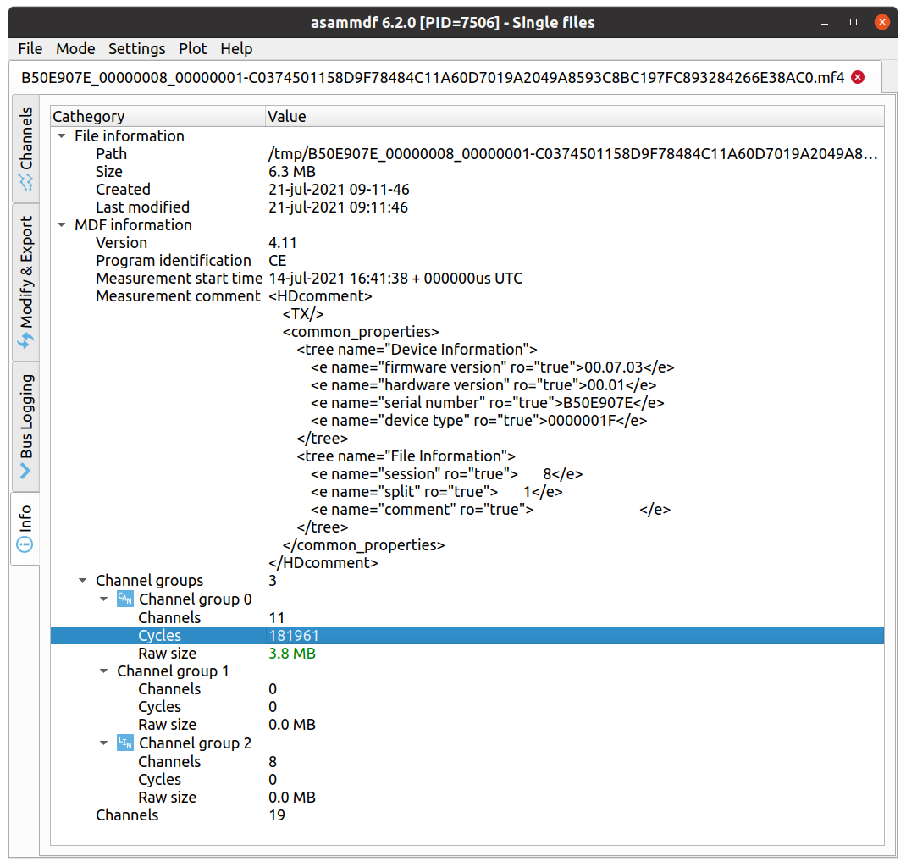
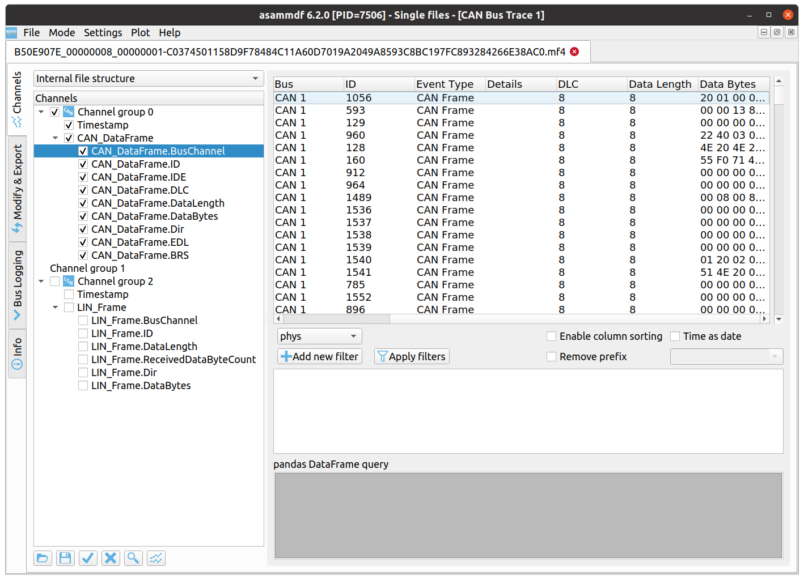

# CAN Analisis

Se grabaron 4 archivos:

* B50E907E_00000008_00000001-C0374501158D9F78484C11A60D7019A2049A8593C8BC197FC893284266E38AC0.mf4
* B50E907E_00000009_00000001-41221EEDDED05370015E6062BA9F6329ABF14E0A254BB49ABADEDDA3B5A02BDF.mf4
* B50E907E_00000010_00000001-CF9ACDBA2F371BA4F9793ABD00B615014FACAD24B775BA38A9ACD408706B19E5.mf4
* B50E907E_00000011_00000001-FC99CDE60865D2B776AF38DA611B649ECDF2D76A57A81CB872E751E0F6CB3AB6.mf4

Estan el el formato MDF version 4.11

Encontramos una herramienta en python asammdf que permite mirar el contenido de los archivos

## Instalación

pip install asammdf

# Información Básica del Archivo

# Información de los datos en el Archivo

# Inico de medición (Measurement Start Date) 

* 14-jul-2021 16:41:38 + 000000us UTC
* 14-jul-2021 16:45:34 + 000000us UTC
* 14-jul-2021 16:49:20 + 000000us UTC
* 14-jul-2021 16:49:26 + 000000us UTC

# MDF4 Converters

Se encontró unos herramientas para convertir MDF4 a un formato más facil para procesar

<https://github.com/CSS-Electronics/mdf4-converters/releases>

* mdf2asc
* mdf2csv
* mdf2pcap
* mdf2socketcan
* mdf2clx000
* mdf2finalized
* mdf2peak

Hay versiones para Linux y Windows.

Utilizando mdf2csv se convertio los archivos mdf a csv

Nota se pude hacer la misma conversion utilizando asammdf pero el proceso es más configurable y tiene más pasos.

Ver [CAN Ids](can_ids.md)

