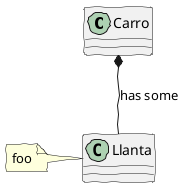
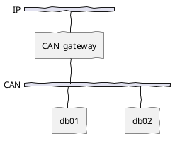

# Clases

```plantuml
@startuml
skinparam handwritten true
class Carro [[http://plantuml.com/link]]
class Llanta [[http://plantuml.com/sequence]]
note left [[http://plantuml.com]]
foo
end note
Carro *-- Llanta [[http://plantuml.com/class]] : has some
@enduml
```

```plantuml
@startuml
skinparam handwritten true
nwdiag {
  network IP {
      //address = "210.x.x.x/24"

      CAN_gateway 
      //[address = "210.x.x.1"];
  }
  network CAN {
      //address = "172.x.x.x/24";

      CAN_gateway 
      //[address = "172.x.x.1"];
      db01;
      db02;
  }
}
@enduml
```
