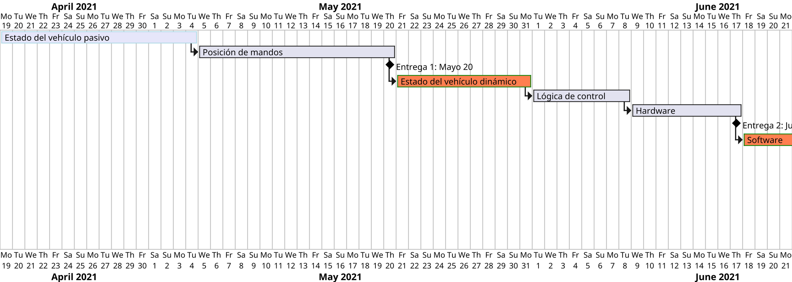

# Cronograma

```plantuml
@startuml
@startgantt
scale 4
Project starts the 2021/04/19
[Estado del vehículo pasivo] is colored in Lavender/LightBlue and lasts 16 days
[Posición de mandos] starts at [Estado del vehículo pasivo]'s end and lasts 16 days
[Entrega 1: Mayo 20] happens at [Posición de mandos]'s end
[Estado del vehículo dinámico] lasts 11 days and is colored in Coral/Green and starts at [Posición de mandos]'s end
[Lógica de control] starts at [Estado del vehículo dinámico]'s end and lasts 8 days
[Hardware] starts at [Lógica de control]'s end and lasts 9 days
[Entrega 2: Junio 17] happens at [Hardware]'s end
[Software] is colored in Coral/Green and starts at [Hardware]'s end and lasts 11 days
[Herramienta de desarrollo] starts at [Software]'s end and lasts 10 days
[Entrega 3: Julio 8] happens at [Herramienta de desarrollo]'s end
[Pruebas puntuales] starts at [Herramienta de desarrollo]'s end and lasts 21 days
[Pruebas vehiculares] starts at [Pruebas puntuales]'s end and lasts 21 days
[Entrega 4: Agosto 19] happens at [Pruebas vehiculares]'s end
[Informe final] starts at [Pruebas vehiculares]'s end and lasts 21 days
[Entrega 5: Septiembre 9] happens at [Informe final]'s end
@endgantt
@enduml
```
