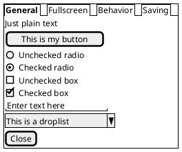

# Interfaz de Usuario

<https://plantuml.com/salt>

```plantuml
@startsalt
{+
{/ <b>General | Fullscreen | Behavior | Saving }
{
Just plain text
  [This is my button]
  ()  Unchecked radio
  (X) Checked radio
  []  Unchecked box
  [X] Checked box
  "Enter text here   "
  ^This is a droplist^
}
[Close]
}
@endsalt
```
