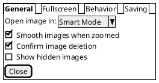

# Interfaz de Usuario

<https://plantuml.com/salt>

# Light and Versatile Graphics Library (LVGL)

LVGL is an open-source graphics library providing everything you need to create embedded GUI with easy-to-use graphical elements, beautiful visual effects and low memory footprint.

<https://docs.lvgl.io/latest/en/html/index.html>

## Open source, free, C

LVGL is hosted on GitHub with MIT license. It's really free to use. 

## Any platform

Use LVGL on any platforms, such as NXP LPC or iMX, STM32, PIC, Arduino, ESP32, Raspberry and so on. 

## Small fooprint

64 kB flash and 8 kB RAM is enough for a simple user inteface.

## Any display

Drive monochrom, OLED, TFT displays, monitors or any other displays. 

Fuente <https://lvgl.io/>

# Rust Library

<https://crates.io/crates/lvgl>

<https://docs.rs/lvgl/0.5.2>

# Embedded Graphics (Rust)

<https://crates.io/crates/embedded-graphics>

A core goal of embedded-graphics is to draw graphics without using any buffers; the crate is no_std compatible and works without a dynamic memory allocator, and without pre-allocating large chunks of memory. To achieve this, it takes an Iterator based approach, where pixel values and positions are calculated on the fly, with the minimum of saved state. This allows the consuming application to use far less RAM at little to no performance penalty.

